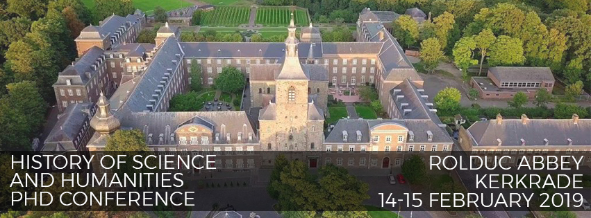
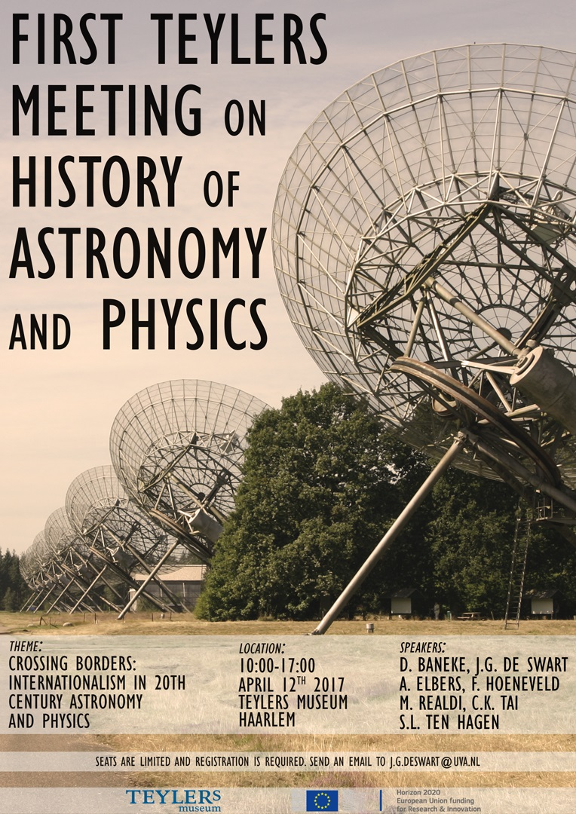
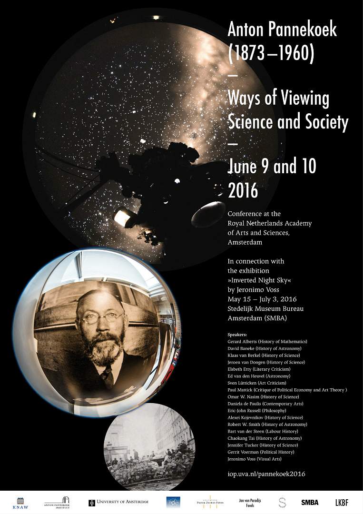
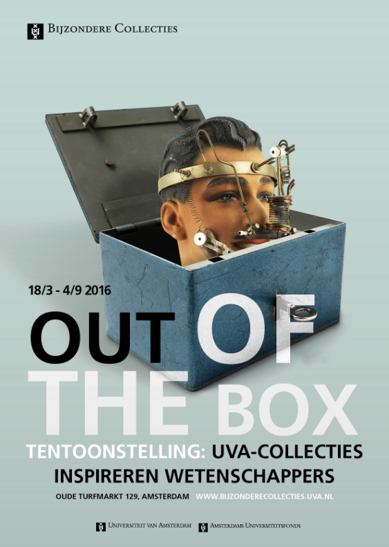

----
Co-organizer of the workshop:  
**7th Low Countries History of Science and Humanities PhD Conference**  
Rolduc Abbey, Kerkrade  
14 & 15 February 2019

[Call for Papers](files/CfP-rolduc2019.pdf)  
[Programme and Abstracts](files/Rolduc-19-Programme-booklet.pdf)  
[Report](https://www.shellsandpebbles.com/2019/04/23/history-of-science-and-humanities-phd-conference-2019-a-thematic-report/)

---

Co-organizer of the workshop:  
**First Teylers Meeting on History of Astronomy and Physics  
Crossing Borders: Internationalism in 20th Century Astronomy and Physics**  
Teylers Museum, Haarlem  
12 April 2017

{: width="540" }

[Programme](files/TeylersMeetingAnnouncement.pdf)

---

Co-organizer of the international conference:  
**Anton Pannekoek (1873-1960): Ways of Viewing Science and Society**  
Royal Netherlands Academy of Arts and Sciences, Amsterdam  
9 & 10 June 2016

{: width="540" }

[Call for papers](files/CfP-Pannekoek2016-final.pdf)  
[Programme and Abstracts](files/Programme-pannekoek2016.pdf)  
[Report](https://www.dwc.knaw.nl/verslag-congres-anton-pannekoek-1873-1960-ways-of-viewing-science-and-society-amsterdam-9-10-juni-2016/)

---

Guest curator of the exhibition:  
**Out of the Box: UvA-collecties inspireren wetenschappers**  
Bijzondere Collecties, University of Amsterdam  
18 March – 4 September 2016

{: width="540" }

[Exhibition Booklet](https://issuu.com/bijzonderecollectiesuva/docs/out_of_the_box)