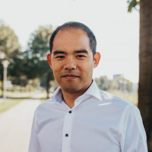

{: style="float: right; margin-right: 2em"}
My name is Chaokang Tai. I am a historian of science, currently employed as Lecturer in Academic Skills and Philosophy of Science at the University of Amsterdam.

In my current research, I investigate the [material history of astrophotography](astrophotography) as it was performed at Leiden Observatory in the middle of the twentieth century. The main focus is on delineating the workflow of astrophotographic research all the way from exposure to publication. Since almost half of the 45,000 photographic plates stored at the observatory originate from South Africa, I also explore the colonial ties between Leiden and Union Observatory in Johannesburg. Additionally, I have investigated the lives and careers of the computers working at Leiden Observatory. 

My PhD research was conducted at the University of Amsterdam, for which I investigated the scientific research of the influential Marxist and astronomer [Anton Pannekoek](pannekoek). During this research, I focused on Pannekoek’s implementation of astrophotography, the epistemic virtues he pursued in his research, and the relation between his scientific methodology and his political philosophy. I have also taught various classes, including the graduate course Philosophy of Science and the undergraduate course History and Philosophy of Science at the University of Amsterdam, and the undergraduate course History of Modern Physics at Utrecht University.

Recent [publications](publications) include _Anton Pannekoek: Photography, Epistemic Virtues, and Political Philosophy in Early-Twentieth Century Astronomy_ (PhD dissertation, University of Amsterdam, 2021; _Anton Pannekoek: Ways of Viewing Science and Society_ (Amsterdam University Press, 2019), edited with Bart van der Steen and Jeroen van Dongen; and “Left Radicalism and the Milky Way: Connecting the Scientific and Socialist Virtues of Anton Pannekoek” in _Historical Studies of the Natural Sciences_ 47 (2017): 200-254.