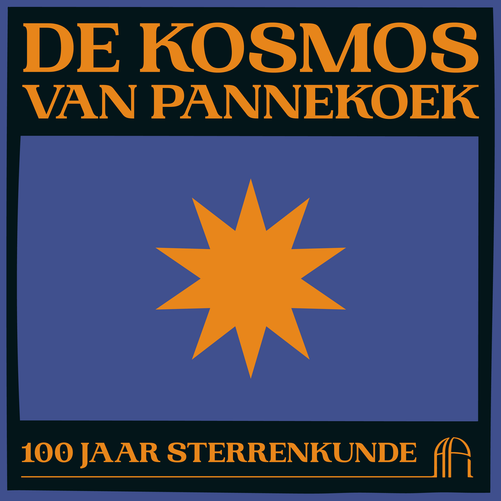
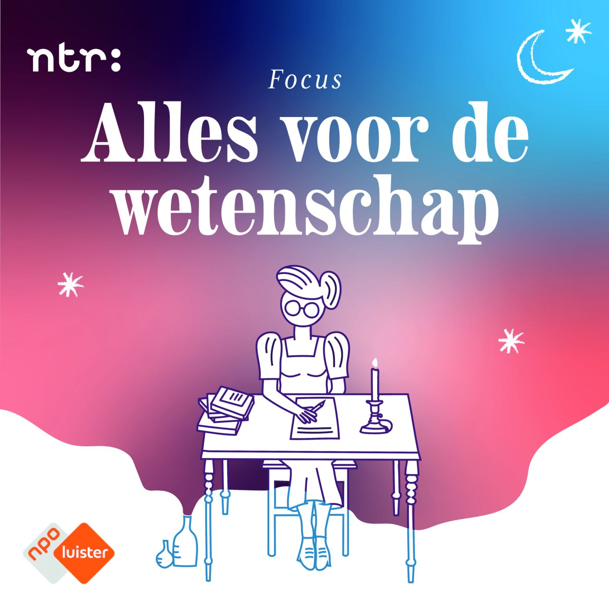

## The kosmos van Pannekoek

{: width="400"}

Podcast: [_De Kosmos van Pannekoek_](https://api.uva.nl/nl/over-ons/geschiedenis/podcast-de-kosmos-van-pannekoek/podcast.html)  
Published 10 June 2022  
Created by Edda Heinsman  
Hosted by Edda Heinsman and Chaokang Tai  

Episode 1: **De mysterieuze melkweg**  
Guests: Sera Markoff and Milo Grootjen

Episode 2: **Stralende ster**  
Guests: Alex de Koter and Ed van den Heuvel

Episode 3: **Astronoom zonder telescoop**  
Guests: Nathalie Degenaar and Ed van den Heuvel

Episode 4: **Jacht op verre werelden**  
Guests: Carsten Dominik and Ralph Weijers

Episode 5: **Beter, gelukkiger, rijker**  
Guests: Gijs Nelemans, Jan Heerze, en Loek Scheurs 

------

## Alles voor de wetenschap

{: width="400"}

NPO Focus Podcast: _Alles voor de wetenschap_
Created by Edda Heinsman

Episode 1: [**Pure fascinatie voor de sterren**](https://www.nporadio1.nl/podcasts/focus-wetenschap/109625/1-alles-voor-de-wetenschap-1-pure-fascinatie-voor-de-sterren)  
Guests: Chaokang Tai, Ed van den Heuvel, and Dick van Albada

