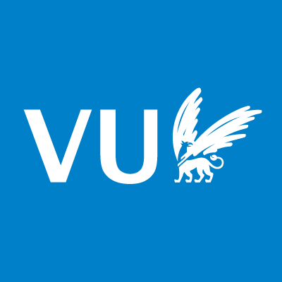
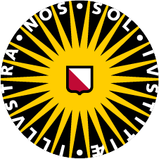

| Course name                                        | Institute&nbsp;&nbsp;&nbsp;&nbsp;&nbsp;&nbsp;&nbsp;                                                                                                 | Level |  Role[^tasks] | First | Last  |
| -------------------------------------------------- | :-------------------------------------------------------------------------------------------------------------------------------------: | ----- | -------------------- | ------------ | ----- | ----- | 
| Professionele Vaardigheden en Loopbaanontwikkeling | {: height="40"}&nbsp;{: height="40"}   | BSc 2 |  CT           | 23/24 | 25/26 |
| Academische Vaardigheden en Tutoraat               | {: height="40"}&nbsp;{: height="40"}   | BSc 1 |  T            | 23/24 | 25/26 |
| Reflection on Chemistry                            | {: height="40"}                                                                           | BSc 2 |  DLT          | 23/24 | 25/26 |     
| History and Philosophy of Science                  | {: height="40"}                                                                           | BSc 3 |  DCLT         | 16/17 | 25/26 |     
| Reflectie op natuurkunde                           | {: height="40"}                                                                           | BSc 2 |  T            | 23/24 | 25/26 |     
| Master Colloquium History of Science               | {: height="40"}                                                                   | MSc   |  C            | 22/23 |       |     
| The Remaking of Astronomy                          | {: height="40"}                                                                   | BSc 3 |  DCT          | 21/22 |       |     
| History of Physics in Society                      | {: height="40"}                                                                   | MSc   |  DCT          | 21/22 | 22/23 |     
| Geschiedenis van de moderne natuurkunde            | {: height="40"}                                                                            | BSc 3 |  LT           | 16/17 | 17/18 |     
| Philosophy of Science                              | {: height="40"}&nbsp;{: height="40"} | MSc   |  T            | 14/15 | 15/16 |     
| Natuurkundepracticum 2                             | {: height="40"}                                                                           | BSc 2 | T            | 08/09 | 09/10 |     
| Natuurkundepracticum 1                             | {: height="40"}                                                                           | BSc 1 | T            | 08/09 |       |     

----

[^tasks]: D= (partially) designed the course  
	C = course (co-)coordinator  
	L = (guest) lecturer  
	T = teach tutorials, seminars, and/or practicals
